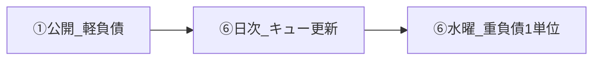

# debt-paydown-workflow.md — シリーズ負債払い運用

最終更新: 2026-06-25 17:53（シリーズ負債カウンタの黄/赤閾値を現運用ペースへ調整）  
用途: `20-investigate-something` 先公開フローで溜まる「後払い負債」の払い方。①（公開）・⑥（日次/週次）が参照。

関連: [`content-folders.md`](content-folders.md)、[`chat-operations.md`](chat-operations.md)、[`lib/series/series.ts`](../../lib/series/series.ts)

---

## 背景とトレードオフ

量産フェーズでは **新規1分Tipsは常に `20-investigate-something` から公開**する（速度優先）。

その代わり、次の負債が溜まる:

- Hub 更新の遅れ
- `series.ts` と実フォルダのズレ
- A/B 層への昇格・`001-` リネームの手戻り
- 逆方向内部リンクの未整備

本ドキュメントは負債を **軽負債（毎公開）** と **重負債（水曜週1単位）** に分け、溜まり続けない運用を定義する。



---

## 負債の種類

| 種類 | タイミング | 担当 | 内容 |
|------|-----------|------|------|
| **軽負債** | 毎公開（①） | Cursor ① | `series.ts` 追記、スポーク→Hub リンク、Vault `promotion_status` |
| **重負債** | 水曜週1単位（⑥→①） | ⑥で選定、①で実装 | Hub 改稿、フォルダ昇格 PR、逆リンク |
| **日次追跡** | 毎日（⑥） | Cursor ⑥ | 分類・debt カウンタ・Hub stale 判定（Vault のみ） |

**変更しない**: 新規の `contentId` 入口（`20`）、`slug` / 公開 URL、`imageBasePath`（昇格時も当面維持可）。

---

## ① 公開時チェックリスト（軽負債・必須）

公開 PR の完了条件に含める。所要目安 5 分以内。

| # | 作業 | 条件 |
|---|------|------|
| 1 | **`series.ts` に spoke 追加** | シリーズが確定している場合のみ。未確定はスキップ可 |
| 2 | **新スポーク本文に Hub リンク1本** | `/blog/[hubSlug]` 形式。Hub 自身の公開時は不要 |
| 3 | **Vault 候補マスターに記録** | `content_folder` + `promotion_status: published_in_20`（⑥が日次で確認） |
| 4 | **同日複数本のクロスリンク** | 既存ルール（公開順に相互リンク） |
| 5 | **公開日を実装日で統一** | 実装開始時に `Get-Date -Format "yyyy-MM-dd"` を取得し、frontmatter `date` と `posts.ts` の `publishedAt` が同じ実装日で一致。inbox の `publishDate` は参照しない |

**週次に回す（公開 PR ではやらない）**

- MD の A/B 層フォルダ移動
- `001-` リネーム
- Hub 本文の全面改稿
- 既存記事への逆リンク一括更新

---

## ⑥ 日次追加タスク

[`maintenance_1min-Tips.md`](D:\ObsidianVault\Vault\00-dashboard\maintenance_1min-Tips.md) の必須タスク D として実施。 **Vault のみ編集**（repo は触らない）。

| タスク | 内容 |
|--------|------|
| **分類ゲート** | 当日公開分の `content_folder` を `series:*` / `topic:*` / `standalone` のいずれかに。`inbox:keep` は「未判断」のみ |
| **debt カウンタ** | Dashboard のシリーズ負債カウンタ4行を更新（定義は下記「debt カウンタ定義」節） |
| **Hub stale 判定** | シリーズごとに `series.ts` の spoke 数 − Hub 本文のスポークリンク数 ≥ 2 → `hub_stale: true` |
| **黄/赤判定** | Hub 未更新・昇格待ち・`20` 総数・週次純増を閾値と照合し、Dashboard に段階を記録（詳細は「閾値トリガー」節） |
| **明日フォーカス同期** | DailyNote reader 3本と inbox `publish_date`（翌日）を一致。Dashboard 明日フォーカスと連動。正本: maintenance_1min-Tips 必須タスク E |

### 日次 +3本公開時の最小手順

1. `posts.ts` で当日 `publishedAt` の3件と `contentId: "20-investigate-something"` 総数を確認する
2. 候補マスターの該当3件だけ `status: published` / `published_date` / `公開` / `promotion_status` を補完する
3. `content_folder: series:*` の記事だけ、昇格アクション待ち（`published_in_20` または `hub_updated`）へ加算する
4. Dashboard のシリーズ負債カウンタ4行を更新する
5. Hub stale は日次では広範囲再判定しない。`series.ts` 追加やHub差分が明らかな場合だけ該当シリーズを補正する

---

## ⑥ 水曜 #5 — シリーズ化スキャン（公開キュー拡張）

水曜週次の **#5 公開キュー** 内で実施。新チェック項目は増やさない。**検知と Hub 作成は分離**する。

### スキャン手順（10〜15分）

1. **対象列挙** — `posts.ts` で `contentId: "20-investigate-something"` の公開済み slug を列挙し、候補マスターの `content_folder` / `audience_axis` と突合
2. **クラスタリング** — テーマごとに束ねる（特に `standalone` / `inbox:keep` / 既存 `series:*` 以外 / `topic:*`）
3. **推奨ゲート** — 4項目中 **3以上** で「新シリーズ推奨」:
   - 同一テーマが `20` に **≥3本** 公開済み
   - **既存 `series.ts` の Hub でカバーできない**（統合可能なら新シリーズ禁止）
   - **`audience_axis: reader` が中心**
   - **Hub 記事が読者導線として意味がある**（How-to 連鎖・段階的切り分け）
4. **判定** — 各クラスタを `新Hub` / `既存series統合` / `保留` に分類
5. **ラベル付与** — 新シリーズ候補に `content_folder: series:candidate:<theme-slug>` を付与（週次のみ）

### 出力（必須）

- DailyNote: `series候補: <theme-slug> N本 → 新Hub|既存統合|保留（理由1行）`
- Dashboard: 新シリーズ候補クラスタ・作成キューを更新

### ガードレール（新シリーズ作成）

| ルール | 値 |
|--------|-----|
| 新シリーズ作成上限 | **月1本まで**（超過分はキュー） |
| 最小スポーク | Hub 新設時 **≥3本** 既公開、1年で **8本見込み** |
| 統合優先 | 既存 `series:*` に入るなら **新シリーズ禁止** |
| アクティブ上限 | **`series.ts` 登録が12本超** → 新シリーズ停止、統合/`standalone` 優先 |
| メタ記事 | ブログ運用系は **1クラスタに集約**（`series:candidate:blog-ops-meta` 等） |

### 新シリーズ実装フロー（#6 とは別トラック）

1. 週次 #5 で `series:candidate:<theme-slug>` 付与
2. 月次キャップ内なら **④** で Hub `source.md` → **①** で `series.ts` 新規 + Hub 公開（**別 PR**。Hub 差し替えルールと同様）
3. 以降は軽負債・昇格フローに乗せる

④ 依頼テンプレ: [`chat-operations.md`](chat-operations.md)「④ 新シリーズ Hub 初稿」

---

## ⑥ 水曜「負債払い1単位」（#6）

毎週水曜の週次メンテで **ちょうど1単位だけ** 実施。複数シリーズの同時昇格はしない。

### 選定優先（P0 → P3）

| 優先 | 単位 | 内容 | 担当 |
|------|------|------|------|
| P0 | **Hub 更新** | `hub_stale: true` のシリーズで Hub に未掲載スポークを追記 | ④文案 → ①反映 |
| P1 | **シリーズ昇格 PR** | 1シリーズ分の `20` → A/B 層移動 + `posts.ts` + `001-` リネーム | ① |
| P2 | **逆リンク更新** | 今週公開/昇格スポークについて関連記事1〜2本にリンク追加 | ① |
| P3 | **単発整理** | `standalone` 確定の `promotion_status` を更新 | ⑥のみ |

### 選定ロジック（#5 結果と連携）

```
if hub_stale あり → P0 Hub更新
else if 新シリーズ候補がゲート通過 & N≥5 & 月次キャップ余裕あり
     → #6 skip、来週④Hub初稿を優先（別トラック。Dashboard キューに記録）
else if 既存seriesの20滞留 ≥ 3本 → P1 昇格PR（#5の「既存統合」推奨を優先）
else → P2 逆リンク or P3 skip
```

### ① 依頼テンプレ（水曜⑥から）

```text
【負債払い1単位】
種別: Hub更新 | 昇格PR | 逆リンク
シリーズ: <series slug または contentId>
対象 slug: <slug 一覧>
手順: docs/ai-context/debt-paydown-workflow.md / content-folders.md
```

---

## 閾値トリガー（黄/赤信号）

| 条件 | 段階 | アクション |
|------|------|-----------|
| 同一シリーズが `20` に **5本** 滞留 | 赤 | 翌公開日までに昇格 PR（P1） |
| Hub 未更新シリーズ数 **≥1** | 黄 | 次回水曜 #6 の P0 候補に入れる |
| Hub 未更新シリーズ数 **≥2** | 赤 | 次の①依頼を Hub 更新（P0）に切替 |
| 昇格アクション待ち **≥5本** | 黄 | 次回水曜 #6 の P1 候補に入れる |
| 昇格アクション待ち **≥8本** | 赤 | 整理 PR（P1）を①へ依頼 |
| `20` 総数 **≥50本** | 黄 | 48時間以内に①を整理 PR（P0/P1）へ1回差し替え。公開は継続可 |
| `20` 総数 **≥70本** | 赤 | 赤指標が2つ以上なら翌日の新規3本公開をスキップし、整理 PR を優先 |
| 週次純増 **≥+15本** | 黄 | 次回水曜 #6 の優先度を上げる |
| 週次純増 **≥+25本** | 赤 | 赤指標が2つ以上なら水曜待たず整理① |
| 単発確定（シリーズ化予定なし） | — | 公開時に `standalone`。昇格キューに入れない |

**運用注釈**

- 現ペース（日次 +3本 × 週7日 ≒ **+21本/週**）では、週次純増 +10 は通常範囲
- `20` 総数は公開速度の結果も拾うため、単独では新規公開停止の根拠にしない
- 新規3本公開のスキップは **赤指標が2つ以上同時発生** した場合に発動する
- 黄/赤は「正常/異常」ではなく **ベースライン超過の段階的通知**

---

## debt カウンタ定義（Dashboard 4行）

| 指標 | 集計方法 |
|------|----------|
| `20` 滞留本数 | `posts.ts` で `contentId: "20-investigate-something"` を grep |
| Hub 未更新 | `series.ts` spoke − Hub リンク ≥2 のシリーズ数 |
| **昇格アクション待ち** | 候補マスターで `content_folder: series:*` かつ `promotion_status` が `published_in_20` **または** `hub_updated` |
| **週次純増** | 当週の `20` 滞留 − 前週水曜（または前回記録）の値。⑥日次で Dashboard に記入 |

---

## promotion_status（Vault 候補マスター）

`content_folder`（配置先分類）と別軸。公開済み記事の負債段階を追跡する。

| 値 | 意味 |
|----|------|
| `published_in_20` | 公開済み・`20` に配置（デフォルト） |
| `hub_updated` | Hub に当該スポークを反映済み |
| `promoted` | A/B 層へ昇格済み（`posts.ts` contentId 更新済み） |
| `standalone` | 単発確定。昇格対象外 |

**状態遷移**

```
公開 → published_in_20
Hub追記済 → hub_updated（当該シリーズの hub_stale 解除）
A層移動済 → promoted
```

Vault 定義の正本: `00-dashboard/content-folder-labels.md`

---

## 初期バックログ（昇格・Hub 優先順）

水曜1単位ずつ消化する目安。

| 週 | 単位 | 対象 |
|----|------|------|
| 1 | Hub 更新 | `cursor-free-series`（`20` 滞留スポークの Hub 反映） |
| 2 | 昇格 PR | `cursor-free-series` → `03-cursor-free` |
| 3 | Hub 更新 | `site-launch-series`（`blog-page-size-15-tips` 等） |
| 4 | 昇格 PR | `site-launch-series` 残り → `01-site-launch` |
| 5 | Hub 更新 | `claude-obsidian-workflow-series`（`obsidian-dashboard-focus-tips` 等） |
| 6以降 | #5 スキャン | `series:candidate` 付与。月1本以内なら ④→① で新 Hub |

`08-new-domain-seo` は昇格済み。Hub 差し替え（`013` 原稿）は [`content-folders.md`](content-folders.md) のとおり別 PR。

---

## スロット分担

| 作業 | スロット | タイミング |
|------|----------|-----------|
| 本文初稿 | ④ Claude | 公開前 |
| 軽負債・build・PR | ① Cursor | 公開時 |
| debt カウンタ・分類 | ⑥ Cursor | 毎日 |
| シリーズ化スキャン | ⑥ Cursor | 水曜 #5 |
| Hub 改稿文案 | ④ Claude | Hub stale / 新シリーズ候補時 |
| 重負債（昇格・逆リンク） | ① Cursor | 水曜 #6 |
| 新シリーズ Hub 実装 | ④→① | 月0〜1本（#5 推奨後） |
| GSC 影響確認 | ② Cursor | 昇格後（imageBasePath 不変なら軽く） |
